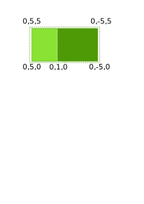
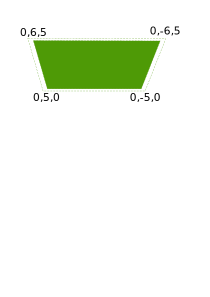
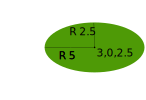
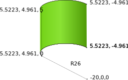
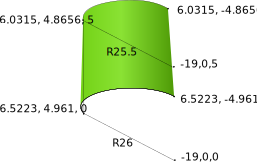
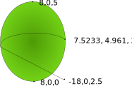
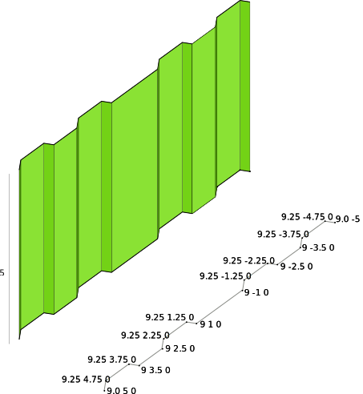
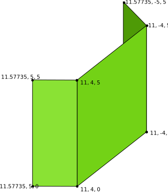

# Geometry Test

The 'geometryTest_V300.3docx' file test a lot of geometry primitives 
for curves and surfaces defined in the OCX schema.

###Frame0
A panel on a X-plane defined on [0,0,0].
The Surface is defined as inline plane, the outer contour is defined by a polyline.
The dimensions of the panel is 10m width, 5m height.
A seam at y=1 splits the panel in two plates with t=10mm (PS), t=12mm (over centerline). 

### Frame1
A panel on the X-plane defined on [1,0,0].
The surface is defined by a grid references, 
the outer contour is defined by a composite curve from 4 lines.
The panel contains one plate with t=12mm.

### Frame2
A panel on the X-plane defined on [2,0,0].
The surface is defined by a reference surface.
the outer contour is defined by a composite curve from 2 lines
and 2 arcs defined by three points.
The panel contains one plate with t=12mm.

### Frame3
A panel on the X-planed defined on [3,0,0].
The Surface is defined as inline plane, the outer contour is defined by a full circle.
The centre point is on [3,0,2.5], the radius is 5m.

### Frame4
A panel on the X-planed defined on [4,0,0].
The surface is defined as inline plane, the outer contour is defined by 
an ellipse with the major axis pointing to portside [0,1,0], 
a major diameter of 10m, a minor diameter of 5m.

### Frame5
A panel on the X-planed defined on [5,0,0].
The surface is defined as inline plane, the outer contour is defined by a
circum circle defined by three points.

### Frame6
A panel on the cylinder surface approximately at [6,0,0].
The surface is defined as reference cylinder at [-20,0,0], 
the cylinder axis [0,0,1], a radius of 26m and a height of 5m.

### Frame7
A panel on the conic surface approximately at [7,0,0].
The surface is defined as reference cone with a base at [-19,0,0], and the
smaller diameter around [-19,0,5] (cone axis [0,0,1]).
The bottom radius is 26m, the top radius 25.5m.

### Frame8
A panel on the sphere cap approximately at [8,0,0].
The surface is defined as reference sphere cap with a center at [-18,0,0] and 
a radius of 26m. The outer contour is defined by a composite curve containing two arcs.

### Frame9
A panel on an extruded surface at [9,0,0].
The surface is defined based on a polyline and then extruded by 5m in z-direction. 

### Frame10
A panel on an extruded surface approximately at [10,0,0].
The surface is defined based on the same polyline as with frame 9, 
but then using a an arc through the points [10 0 0], [10.25 0 2.5], and [10 0 5] as extrusion curve.

### Frame11
A panel on an surface collection approximately at [11,0,0].
The surface is composed of the planar facets.

